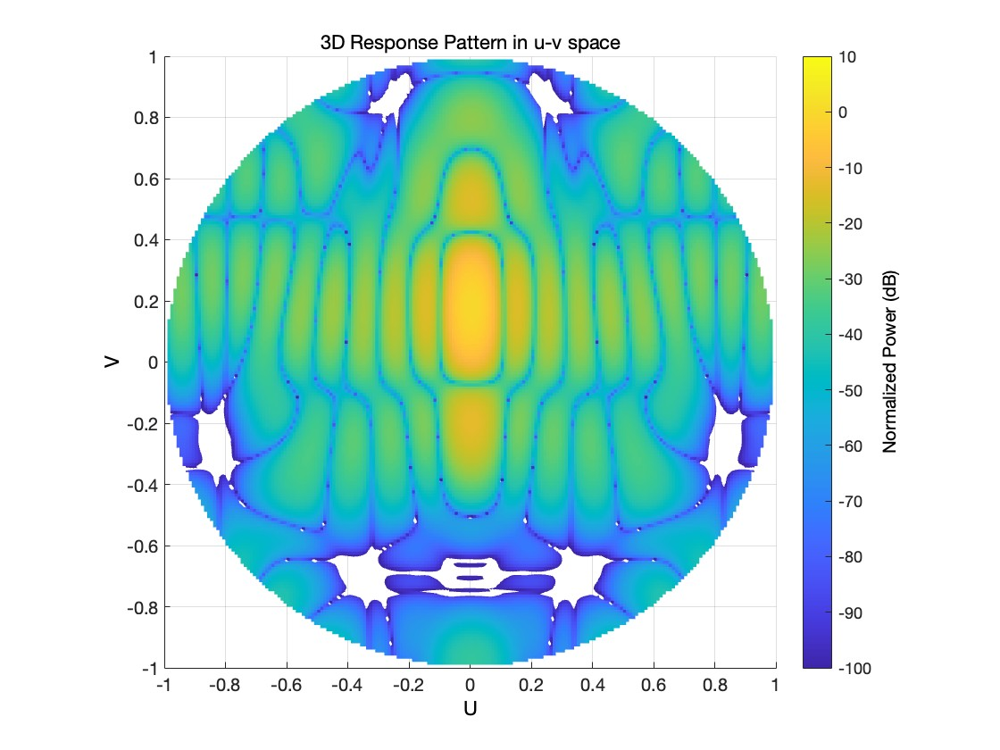
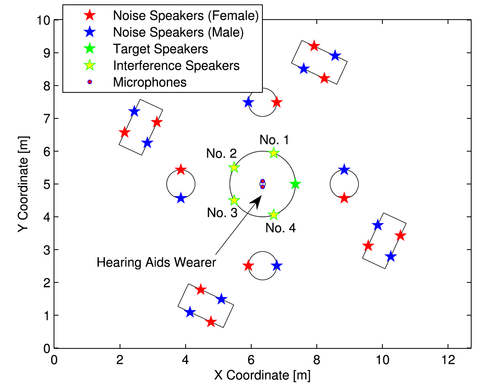
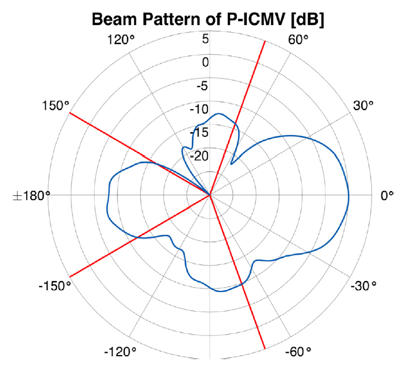

# PICMV-Beamforming
 Robust Beamforming Algorithm

 # Robust Beamforming with DoF Limitation

**Description:** A well-known challenge in beamforming is how to optimally utilize the degrees of freedom (DoF) of the array to design a robust beamformer, especially when the array DoF is limited. We leverage the tool of constrained convex optimization and propose a penalized inequality-constrained minimum variance (P-ICMV) beamformer to address this challenge. 

**Key Tech:**  min-max penalization, worst-case optimization, variable splitting

**Date:** 2017 - 2021

**People:** Wenqiang PU

**Optimization Problem:** 

```math
\begin{equation*}
\begin{aligned}
\min_{\mathbf{w},{\epsilon}}\ & \mathbf{w}^H\mathbf{R}\mathbf{w}+\mu\max_{k}\{ \gamma_k \epsilon_k   \}\\
\textrm{s.t.}\ &|\mathbf{w}^H\mathbf{a}_\theta-1| + \delta \| \mathbf{w}\|\leq c_\theta,\ \forall \theta\in\Theta,\\
& |\mathbf{w}^H\mathbf{a}_\phi| + \delta\|\mathbf{w} \|\leq \epsilon_k c_\phi,\ \forall \phi\in\Phi_k,\ \forall k.
\end{aligned}
\end{equation*}
```


- $\mathbf{w}$ — beamformer
- ${\epsilon}$  — auxillary variable
- $\mathbf{a}_{\theta}$, $\mathbf{a}_{\phi}$ — steering vector
- $c_\theta, c_\phi, \gamma_k, \mu, \delta$ — user specified parameters
- $\mathbf{R}$ — PSD matrix, e.g., identity matrix $\mathbf{I}$, sample mean covariance matrix

**Optimization Algorithm:** ADMM based algorithm, see details in [](https://www.notion.so/Robust-Beamforming-with-DoF-Limitation-604bdb70c58b446e9637f7fb8054ba19?pvs=21)reference.

**Example 1: Robust Beam Pattern Synthesis** 

**Setting:** 30 $\times$ 30 array, 7 null region with more than 1000 inequality constraints

<div align=center>
 
</div>
**Example 2: Speech Enhancement of Mic. Array**

**Setting:** 4 mic., 4 interferences and 1 target source.

<div align=center>
 
 
</div>


**Reference:** Pu, W., Xiao, J., Zhang, T., & Luo, Z. Q. (2023). A penalized inequality-constrained approach for robust beamforming with dof limitation. *Signal Processing*, *202*, 108746.
